## KZ Augur and Nextstrain Pipeline

* Updated 2023-09-20 to streamlit, see previous version for command line

#### Install
- install docker https://docs.docker.com/engine/install/ubuntu/
    - Follow postinstallation instructions
    - `sudo groupadd docker`
    - `sudo usermod -aG docker $USER`
    - Restart your terminal and type in `groups`. If docker is not there restart your computer and check again.
- install miniconda https://docs.conda.io/projects/conda/en/latest/user-guide/install/linux.html
- Git clone this repo
    - `cd` to where you want this folder
    - `git clone git@pandora.mriglobal.org:cprice/kz_augur.git`
- Download the associated kz_tar.gz_v1.0.0 by clicking on 'releases' and then on the kz.tar.gz to start the Download
    - move the downloaded tar file to the cloned repo location

##### Releases location on right side bar

  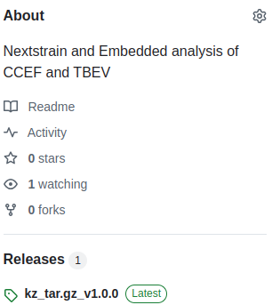

##### Location of kz.tar.gz in releases menu

  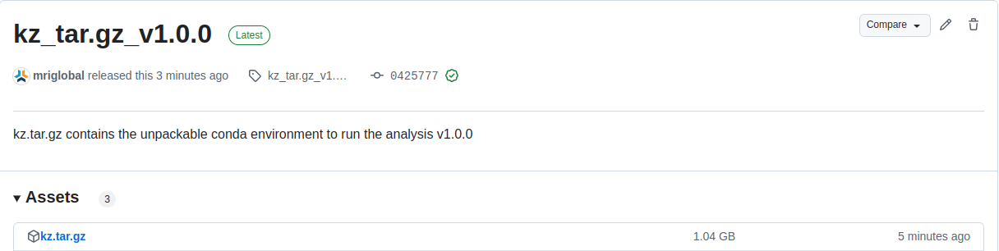

- Set up the environment when the kz.tar.gz is in the git repo
    - `bash install_environment.sh`
    - `source source kz_env/bin/activate`
- Launch the app
    - `bash start_steamlit.sh`
    - if it doesn't automatically pop up in web browser, navigate to http://localhost:8501 to use the app

#### Process Description
The pipeline begins with the mapping of the fastq sequences to the selected reference, either Crimean Congo Hemorrhagic Fever (CCHF) or Tick Borne Encephalitis Virus (TBEV) using Minimap2. The output is a .SAM file, which is then converted and sorted into a .BAM file using Samtools. Then, Bcftools performs variant calling on the sorted .BAM file to create a compressed vcf.gz file. Tabix is then used to create an index file for the vcf file. The final component of this initial step is a consensus sequence generation from the VCF file using Bcftools, aligning the variants back to the reference genome to create the consensus .FASTA file.

If the reference is specified as CCHF, the method only retains the shortest “S” segment of the genome as the sole focus of analysis. This process also integrates the uploaded sequence data alongside user specified meta data into an existing metadata table, which ensures each unique entry has a unqiue identifier for future runs. 

After uploading the files for analysis, the next step is to run nexstrain. Before running the Augur/Nexstrain pipeline a multiple sequence alignment is generated using Augur to the specified reference genome. This is one of the main inputs to the Augur/Nexstrain pipeline. In the pipeline, the first step is to constructed the phylogenetic tree using IQ-TREE via the augur tree function. Next is the tree refinement step, wherein the intial tree is refined using the augur refine function. This step adjusts branch lengths and resolves potential conflicts in the metadata to ensure a most accurate depiction of evolutionary relationships. The next step is the augur ancestral function, which takes the refined tree and interpolates ancestral sequences between steps, filling in gaps of how sequences may have evolved where data is absent. Mutations are then annotated using the augur translate function, which transforms the ancestral sequences into amino acid representations to identify mutations. Finally, augur traits is called as the final function which uses metadata features to correlated phylogenetic traits with metadata features. The output is then exported to a .json format compatible with Auspice, a visualization tool. All generated data by the augur pipeline and the metadata is then able to be rednered using a nextstrain view command. 

Another method of viewing the uploaded sequence data is through running a sourmash embedding. The function starts by aggregating any input labels with the genbank labeled data for the given CCHF or TBEV input. Each sequence has a MinHash sketch created, and the MinHashes are aggregated. A similarity matrix is created using sourmash compare_all_pairs, which performs a pairwise comparison between all the aggregated sketches. The output is then visualized as an altair dynamic plot, which can be used to explore similarity between the data.

All data can be exported as a final step into a .zip archive

### Application Features
#### Radio buttons on the side allow for navigation between the five pages

  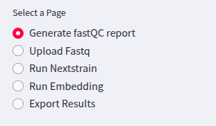

### Generate fastQC report
#### Fastq files can be uploaded on the Generate fastQC report tab to evaluate read qualities. Specify the directory to your data and the dropdown menu will allow you to select which one to generate a report for.

  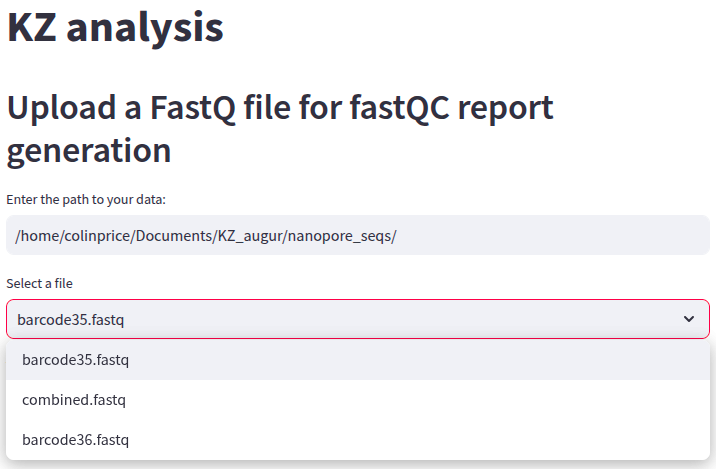

#### Fastqc reports will pop up in a new browser tab, and provide sequence information

  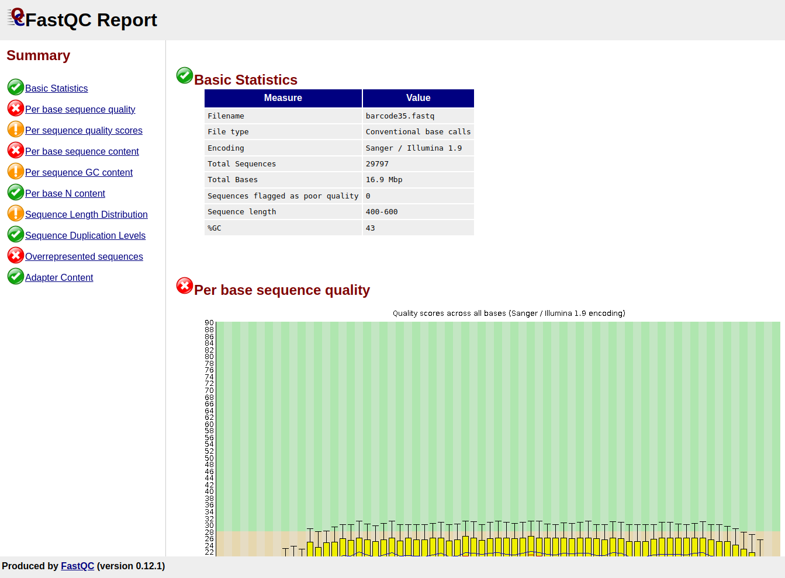

### Upload Fastq
#### Fastq files can be uploaded on the Upload Fastq to assemble and find consensus sequences with the reference ahead of nextstrain and embedding tasks. Upload your sequence and fill in the subsequent metadata fields

  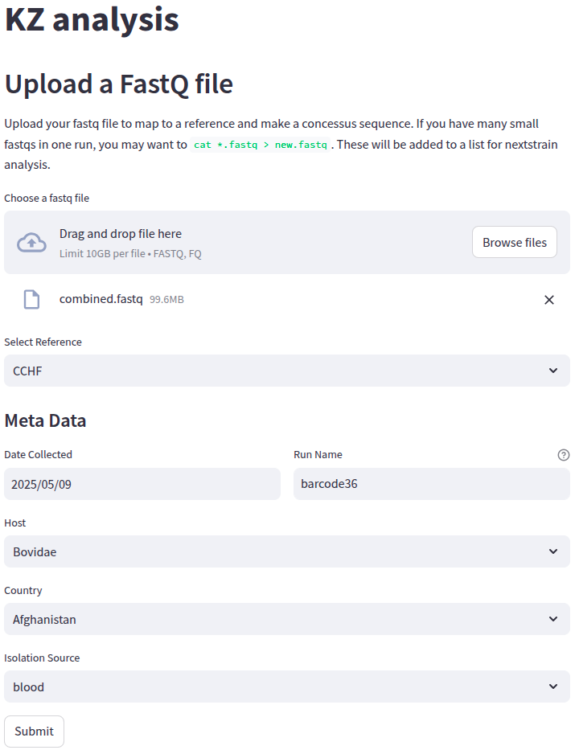

#### Assembly stats as well as a plot of read coverage to the reference is output, and the data is uploaded for downstream analysis

  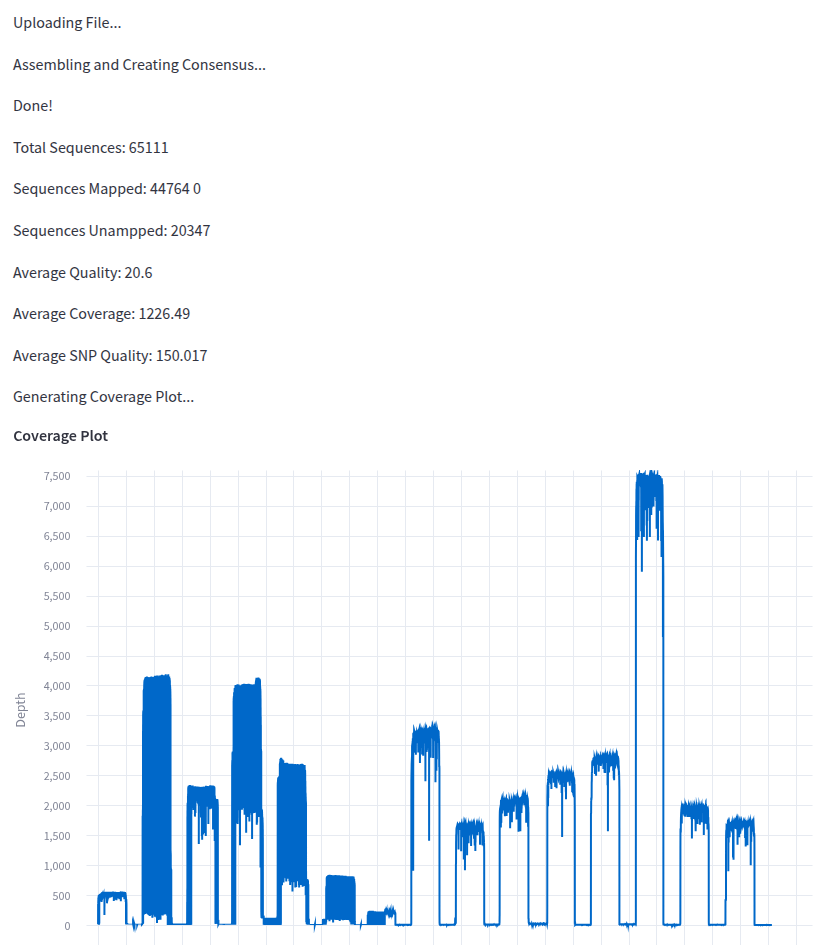

### Run Nextstrain
#### To generate the nextstrain dashboard, select CCHF or TBEV to cycle between the two datasets. The default is to not include NCBI data. Note nextstrain requires at least three sequences to perform analysis

  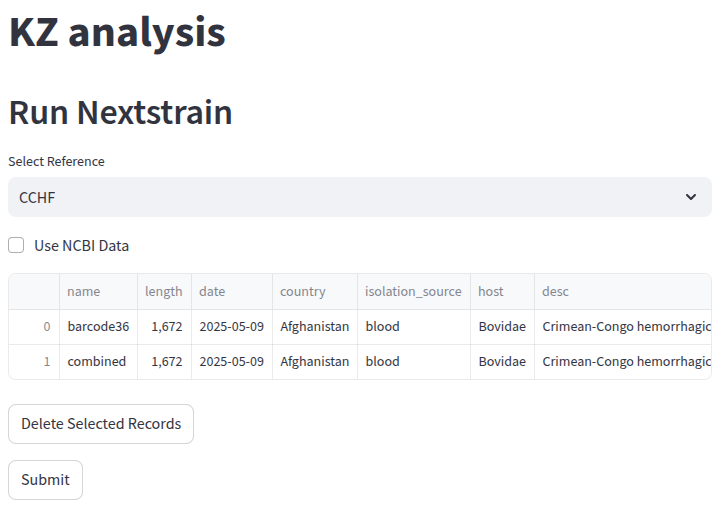

#### Add NCBI data to compare to the available complete genbank records

  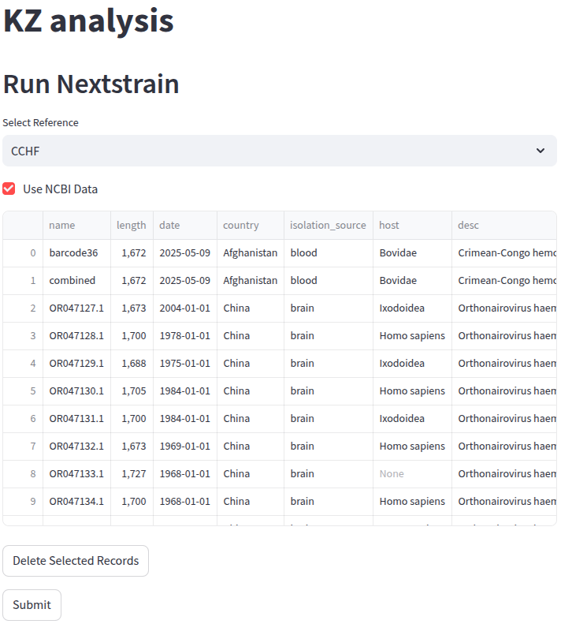

#### Records can individually be selected or deselected for inclusion in the nextstrain dashboard using the checkbox in the Include column. Records can be deleted by checking the Delete column for records to be deleted, then clicking "Delete Selected Records"

  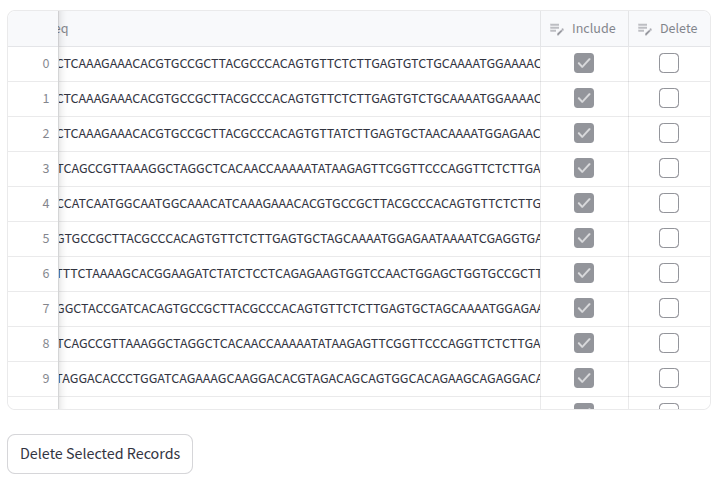

#### The dashboard will pop up in a new tab when the Submit button is clicked. Nextstrain supports many different colorings along metadata categories through the tools on the lefthand side.

  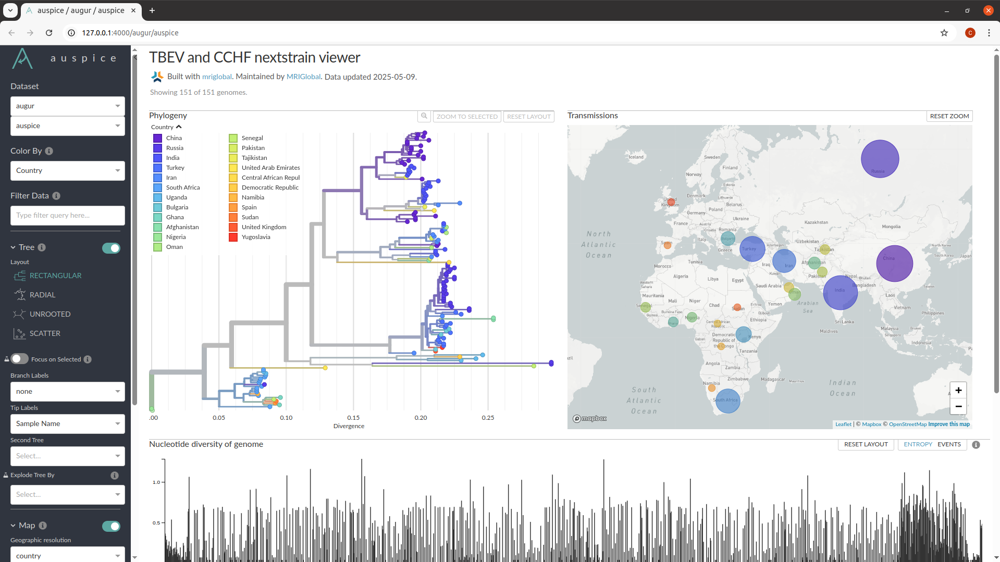

### Run Embedding
#### Uploaded records can be visualized with their metadata labels on a sourmash embedding plot with the available NCBI genbank data on the Run Embedding page

  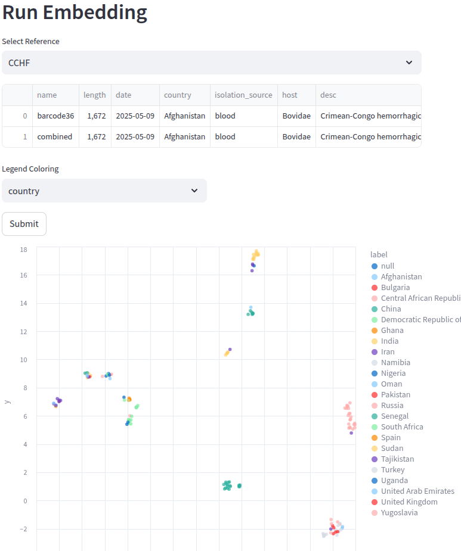

### Export Results
#### Results can be exported as all CCHF, all TBEV, or selected records uploaded by the user. For the Export select sequences button, only records with the Include box check will be exported to the downloaded .zip archive

  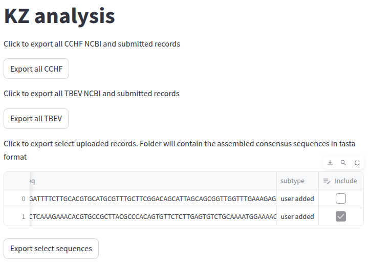

